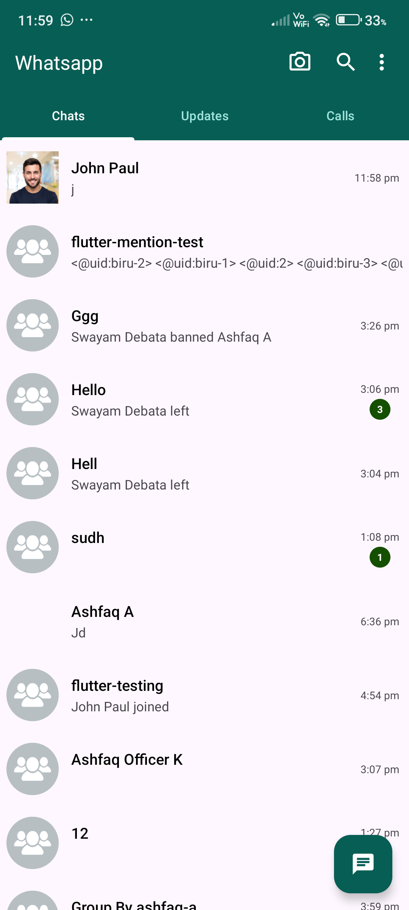
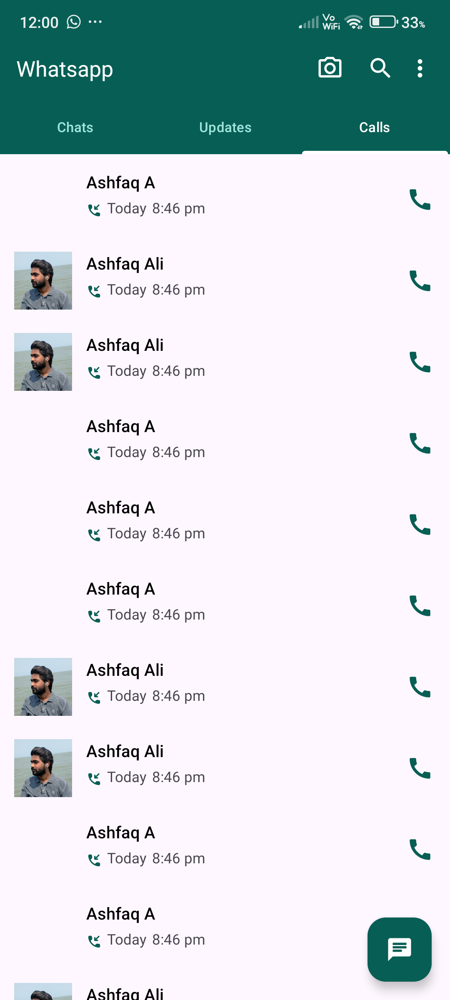
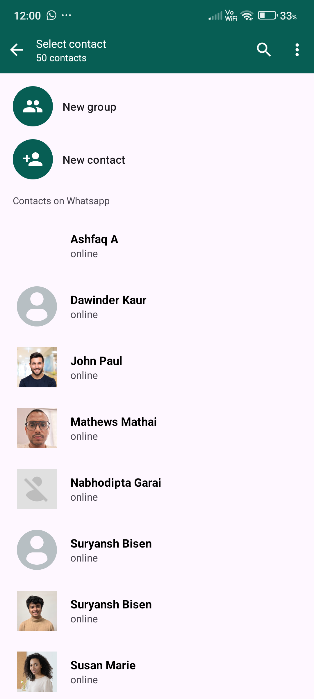
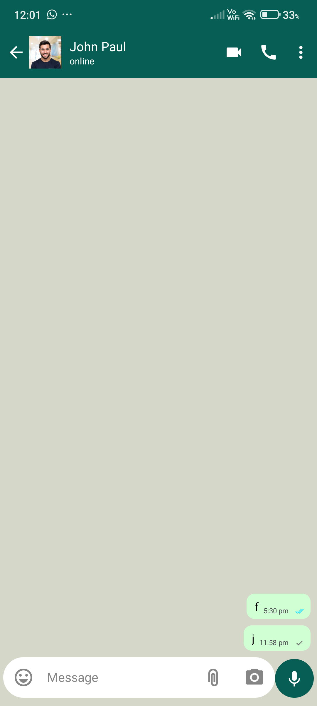
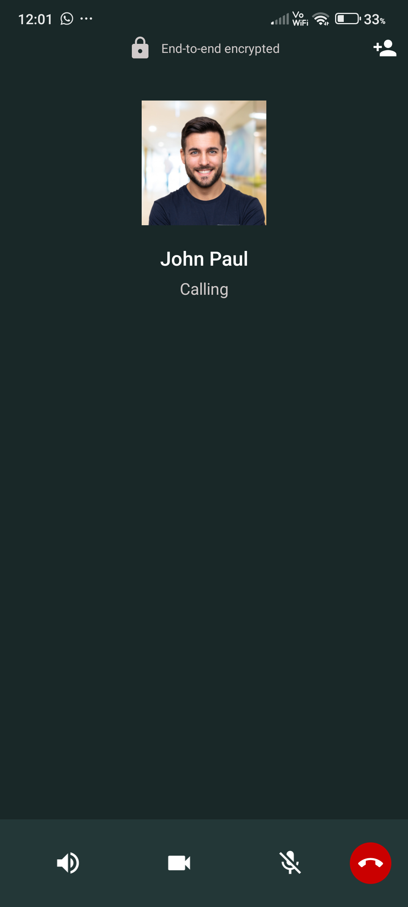
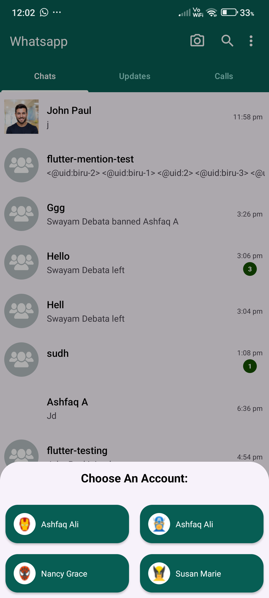

# 📱 WhatsApp Clone – Fully Functional Chat App (XML-Based)

A fully functional WhatsApp-like chat application built using **XML layouts** and **Kotlin**, with real-time messaging powered by the **CometChat Android SDK**. This project replicates the core features and UI of WhatsApp, including one-on-one chat, message deletion, and media support.

  
  
  

  
  
  

---

## 🚀 Features

- Real-time one-on-one chat using **CometChat SDK**
- Custom WhatsApp-style UI built with **XML layouts**
- Message sending, receiving, and deletion
- Media message support (images, videos, etc.)
- User presence and typing indicators
- Clean **MVVM architecture** for scalable development

---

## 🛠️ Tech Stack

- **Kotlin**
- **XML Layouts**
- **MVVM Architecture**
- **CometChat Android SDK**
- **OkHttp** (for advanced CometChat API usage)

---
